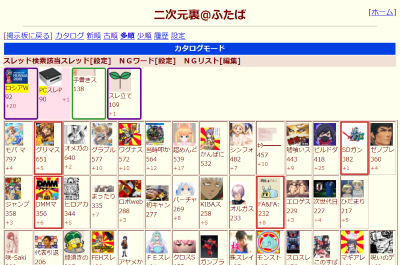

## futaba thread highlighter K
このUserscriptは[himuro\_majika](https://github.com/himuro-majika)氏の[futaba thread highlighter](https://github.com/himuro-majika/futaba_thread_highlighter)を改変したものです。  
ふたば☆ちゃんねるのカタログに現在表示されているすべてのスレ本文の文字列を監視してページトップに一覧表示します。  
一度検索ワードを設定しておけば定時スレ等が探しやすくなります。検索ワードには正規表現が利用できるのでより柔軟にピックアップできます。  
また既読スレをマークできるアドオンとの連携でカタログ内の既読スレのピックアップも可能です。  

Firefoxの場合、[Tampermonkey](https://addons.mozilla.org/ja/firefox/addon/tampermonkey/)を先にインスールしてからスクリプトをインストールして下さい。  
(GreasemonkeyやViolentmonkeyでの動作は未確認です)  
Chromeの場合、[Tampermonkey](https://chrome.google.com/webstore/detail/tampermonkey/dhdgffkkebhmkfjojejmpbldmpobfkfo)を先にインスールしてからスクリプトをインストールして下さい。  

※このUserscriptは単体で利用可能ですが、Firefoxアドオン[KOSHIAN カタログマーカー 改](https://github.com/akoya-tomo/koshian_catalog_marker_kai)・[赤福Firefox SP](http://toshiakisp.github.io/akahuku-firefox-sp/)またはChromeアドオン[ふたクロ](http://futakuro.com/)のいずれかと併用することで既読スレピックアップ機能が利用できます。  
[KOSHIAN カタログマーカー](https://addons.mozilla.org/ja/firefox/addon/koshian-catalog-marker/)のv2.0.0以降では既読スレピックアップ機能は動作しません。  

※その他のふたば閲覧支援ツールは[こちら](https://github.com/akoya-tomo/futaba_auto_reloader_K/wiki/)。

## スクリーンショット
KOSHIAN カタログマーカー改のマークのピックアップ例  
  
ピンクの背景が検索ワードでピックアップしたスレで、文字背景の黄色が検索ワード。枠付きは既読スレ。

## 使い方
* ふたばのカタログモードの設定で「文字数」を適当な大きさ(4以上推奨)に設定してください。(板毎に設定が必要です)
* スレッド検索該当スレッドの[設定]ボタンをクリックして監視したい検索ワードを入力してください。
|で区切ると複数の語句を指定できます。(正規表現使用可。特殊な記号　\\*?+.^$|()[]{}　は全て正規表現のメタキャラクタとして認識されます。)  
検索ワードは全板共通と各板個別でそれぞれ設定できます。  
* 既読スレをマークできるアドオンとの連携でカタログ内の既読スレもピックアップされます。（デフォルト：有効）
* タブの表示が「板名（二次裏のみサーバー名）＋ソート名（カタログ・新順・古順etc）」に変更されます。（デフォルト：有効）
  - フレーム表示では動作しません。
* 検索ワードに該当したスレや既読スレでも、ふたクロや[合間合間に](http://toshiakisp.github.io/akahuku-firefox-sp/#others)でNGにして消すとピックアップされなくなります。  
* [ふたば@アプリ としあき\(仮\) 出張版](https://chrome.google.com/webstore/detail/%E3%81%B5%E3%81%9F%E3%81%B0%E3%82%A2%E3%83%97%E3%83%AA-%E3%81%A8%E3%81%97%E3%81%82%E3%81%8D%E4%BB%AE-%E5%87%BA%E5%BC%B5%E7%89%88/nhiegnhgjieegcgdkbneigigmpijbnhe)のキーワード検索が隠れた状態でカタログが開きます。（デフォルト：有効）  
  - 検索バー\[表示\]ボタンをクリックすることで隠れていたキーワード検索バーが出現します。  
* [futaba catalog NG](https://github.com/akoya-tomo/futaba_catalog_NG/)との連携機能追加
  - メニューバーを同じ行で表示したり、NGにしたスレをピックアップ対象外にします。

## インストール
[GreasyFork](https://greasyfork.org/ja/scripts/36639-futaba-thread-highlighter-k)　
[GitHub](https://github.com/akoya-tomo/futaba_thread_highlighter_K/raw/master/futaba_thread_highlighter.user.js)

## 設定
機能の動作はスクリプト冒頭の大文字変数をエディタで編集すれば変更することができます。  

* USE\_BOARD\_NAME : タイトルを板名＋ソート名（カタログ・新順・古順etc）に変更する \(*true*\)  
* USE\_PICKUP\_OPENED\_THREAD : 既読ピックアップ機能を使用する \(*true*\)  
  - [KOSHIAN カタログマーカー 改](https://github.com/akoya-tomo/koshian_catalog_marker_kai)の他に[赤福Firefox SP](http://toshiakisp.github.io/akahuku-firefox-sp/)・[ふたクロ](http://futakuro.com/)でも動作します。
* OPENED\_THREAD\_MARKER\_STYLE : 既読マークのスタイル \(*""*\)  
  - 通常はアドオンが既読マークしたスタイルを自動でコピーしますが、この変数にスタイルを設定すると優先して使用されます。また赤福ではマークのスタイルがコピーできないため、変数横のコメントを参考にスタイルを設定して下さい。  
* HIDE\_FUTAKURO\_SEARCHBAR : ふたば@アプリ としあき\(仮\) 出張版のキーワード検索を隠した状態でカタログを開く \(*true*\)  
* USE\_FUTABA\_CATALOG\_MOD : futaba_catalog_modを使用する \(*false*\)  
  - himuro_majika氏作のユーザースタイルシートfutaba_catalog_mod（[モダンバージョン](https://userstyles.org/styles/114129/futaba-catalog-mod-modern)）（[クラシックバージョン](https://userstyles.org/styles/114130/futaba-catalog-mod-classic)）を使用するときは設定をtrueにして下さい。ピックアップしたスレの本文の長さを制限し、マウスオーバーで本文をポップアップします。  

## 注意事項
* 既読スレのピックアップをしない（できない）場合はスクリプト内の設定USE\_PICKUP\_OPENED\_THREADをfalseにしてください。
* Firefoxアドオン[ねないこ](http://nenaiko.sakura.ne.jp/nenaiko/)と併用する場合は、ねないこの設定より「カタログ2」→「カタログ本文のスタイルを指定する」のチェックを外してください。
* futaba\_catalog\_mod（モダンバージョン）使用時にKOSHIAN カタログマーカー 改のマークが付かないときは[こちら](https://github.com/akoya-tomo/koshian_catalog_marker_kai#注意事項)を参照してください。  

## おまけ
スレ本文の文字数を増やしたらカタログが見づらくて生きるのが辛い場合  
himuro\_majika氏作のユーザースタイルシートも使ってみてください。  
[futaba\_catalog\_mod(モダンバージョン)](https://userstyles.org/styles/114129/futaba-catalog-mod-modern)  
または  
[futaba\_catalog\_mod(クラシックバージョン)※ねないこユーザー向け](https://userstyles.org/styles/114130/futaba-catalog-mod-classic)

## 更新履歴
* v1.6.6rev13 2018-07-06
  - ピックアップのイベント通知を追加（ピックアップしたスレでも他のアドオンやUserscriptが動作できるように）
* v1.6.6rev12 2018-07-03
  - 検索ワードでピックアップしたスレにもKOSHIAN カタログマーカー 改 v2.0以降のマークを反映するように修正
* v1.6.6rev11 2018-07-03
  - KOSHIAN カタログマーカー 改 v2.0以降のマークの色設定に対応
* v1.6.6rev10 2018-06-16
  - ふたクロでソート操作したときにタイトルにソート名が反映されない不具合を修正
  - ふたば@アプリ としあき\(仮\) 出張版のキーワード検索を検出するタイミングを変更
* v1.6.6rev9 2018-05-10
  - 文字スレをピックアップしたときに本文の長さが制限されない不具合を修正
* v1.6.6rev8 2018-05-10
  - futaba_catalog_modへの対応
* v1.6.6rev7 2018-02-24
  - 既読スレのピックアップ条件を修正
* v1.6.6rev6 2018-01-30
  - futaba catalog NGとの連携機能追加
* v1.6.6rev5 2018-01-02
  - KOSHIAN Catalog Marker kai以外のアドオンでも既読スレのピックアップが動作するように変更
  - ふたば@アプリ としあき\(仮\) 出張版のキーワード検索を隠した状態でカタログを開く機能を追加
* v1.6.6rev4 2017-12-29
  - 合間合間にのNGスレをピックアップ除外する処理の不具合修正
  - ピックアップ欄のスレから合間合間にのボタンを削除
* v1.6.6rev3 2017-12-24
  - マーク監視開始前にマーク完了が来た時の処理を変更
* v1.6.6rev2 2017-12-24
  - マーク監視タイムアウト処理に失敗することがあるのを修正
* v1.6.6rev1 2017-12-23
  - KOSHIAN Catarog Marker kaiとの連携で既読スレのピックアップ機能を追加
  - 板名＋ソート名をタブに表示する機能を追加
  - 合間合間にのNGスレをピックアップしないように変更

***

以下、オリジナル版futaba thread highlighterの更新履歴  

* v.1.6.6 2017-03-04
  - 赤福と合間合間にを同時に使用している場合に該当スレッドの表示が乱れる問題を修正(thanks akoya_tomo)
* v.1.6.5 2017-02-25
  - 赤福の最新に更新で動作しなくなっていた問題を修正
* v.1.6.4 2016-11-13
  - https対応
* v.1.6.3 2016-10-03
  - Firefoxで赤福を使用していない時に初期化ができていなかった問題を修正(thanks iroha ao)
* v.1.6.2 2016-07-17
  - 赤福で「カタログを左寄せ」を有効にしていると動作しない問題を修正
* v.1.6.1 2016-06-04
  - 監視処理の最適化
* v.1.6 2015-12-12
  - 設定画面に区切り文字を挿入ボタンを追加
  - 検索ワードの正規表現の処理を修正
* v1.5 2015-07-07
  - 板毎の検索ワードの設定を追加
  - 削除した検索ワードのハイライトが残ったままになる問題を修正
* v1.4 2015-05-21
  - スタイルの調整
  - アイコン追加
* v1.3 2015-05-19
  - スタイルの調整
* v1.2 2015-05-18
  - スタイルの変更
  - 文字スレがマッチした場合の不具合修正
